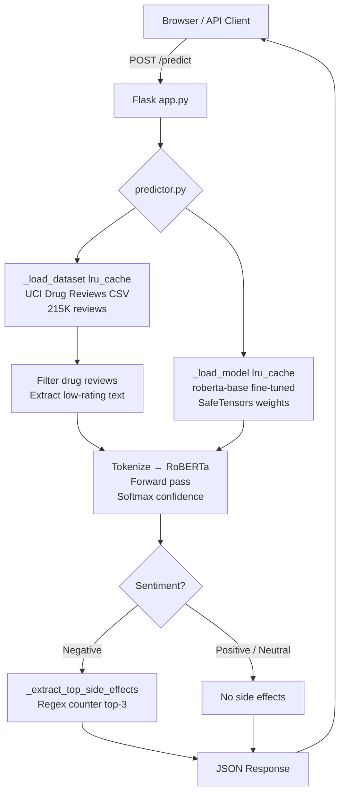

# 💊 Drug Sentiment Analyzer

> **AI-powered pharmacovigilance tool** — fine-tunes `roberta-base` on 215K+ real patient drug reviews to classify sentiment (Negative / Neutral / Positive) and surface the top reported side effects for any drug, served through a lightweight Flask REST API.

<div align="center">

</div>

---

## 📋 Table of Contents

1. [Overview](#-overview)
2. [Demo](#-demo)
3. [Features](#-features)
4. [Architecture](#-architecture)
5. [Tech Stack](#-tech-stack)
6. [Project Structure](#-project-structure)
7. [Setup & Installation](#-setup--installation)
8. [Usage](#-usage)
9. [API Reference](#-api-reference)
10. [Model Details & Training](#-model-details--training)
11. [Known Issues & Fixes](#-known-issues--fixes)
12. [Roadmap](#-roadmap)
13. [Contributing](#-contributing)
14. [License & Acknowledgements](#-license--acknowledgements)

---

## 🔬 Overview

### Problem

Patients and caregivers searching for information on drug side effects are forced to read through hundreds of unstructured reviews on sites like Drugs.com. There is no quick, programmatic way to get a sentiment signal or a prioritized list of adverse effects for a given medication.

### Solution

**Drug Sentiment Analyzer** provides a single-endpoint REST API: send a drug name, receive a structured JSON object containing:

- **Sentiment classification** (Negative / Neutral / Positive) with a confidence percentage
- **Top-3 most frequently reported side effects**, mined from real low-rating patient reviews
- A **data provenance flag** indicating whether the drug exists in the 215K+ review dataset

### Who Is This For?

| Audience | Use Case |
|---|---|
| **Researchers** | Quick programmatic signal on drug tolerability |
| **Students** | End-to-end NLP + Flask project to learn from |
| **Developers** | Drop-in REST endpoint for healthcare applications |
| **Recruiters** | Demonstrates full-stack ML: training → serving → UI |

---

## 🎬 Demo

> **Add your screenshots or GIF here**

```
[Screenshot: Search UI with drug name input field]
[Screenshot: Result card showing Negative sentiment, 87% confidence, side effects]
```

**Try it locally in 3 commands:**

```bash
git clone https://github.com/your-username/drug-side-effect-app.git
cd drug-side-effect-app && pip install -r requirements.txt
python app.py   # → http://localhost:5000
```

---

## ⚡ Features

### Core Features

- **3-Class Sentiment Classifier** — `roberta-base` fine-tuned to output Negative / Neutral / Positive labels with softmax confidence scores
- **Side Effect Extraction** — Hybrid pipeline: SciSpaCy BC5CDR NER (DISEASE entities) + curated 50+ keyword regex, deduplicated and ranked by frequency
- **Real-World Dataset** — UCI Drug Review Dataset: 161,297 training + 53,766 test reviews across 3,400+ unique drugs
- **REST API** — Single `POST /predict` endpoint returning structured JSON; no frontend required
- **Vanilla Frontend** — No JS framework; clean search UI with animated confidence bar and sentiment badge

### Engineering Highlights

- **`@lru_cache` model loading** — Model and dataset are loaded once per process; zero repeated I/O overhead on subsequent requests
- **CUDA / CPU adaptive inference** — Automatically detects and uses GPU; graceful CPU fallback requires no config change
- **Class-weighted training** — `compute_class_weight('balanced')` applied via custom `WeightedTrainer` to handle the natural positive-skew in drug reviews
- **Cosine LR schedule** — `lr_scheduler_type='cosine'` with 10% warmup steps for stable fine-tuning
- **Mixed precision** — `fp16=True` automatically enabled when a CUDA device is detected
- **SafeTensors format** — Model weights stored as `.safetensors` for faster, safer loading vs. pickle-based `.bin`

---

## 🏗 Architecture

### Data Flow

```
User Input (drug name)
        │
        ▼
┌───────────────────┐
│   Flask  app.py   │  POST /predict
│   Route Handler   │
└────────┬──────────┘
         │
         ▼
┌────────────────────────────────────────────────┐
│               predictor.py                     │
│                                                │
│  1. _load_dataset()  [lru_cache]               │
│     └─ Concat train + test CSVs               │
│     └─ Filter by drug name (case-insensitive) │
│     └─ Extract low-rating reviews (≤ 5★)      │
│                                                │
│  2. _load_model()  [lru_cache]                 │
│     └─ AutoTokenizer (use_fast=False)          │
│     └─ RobertaForSequenceClassification        │
│     └─ .eval() + .to(device)                  │
│                                                │
│  3. Inference                                  │
│     └─ Tokenize (max_length=512, truncate)    │
│     └─ Forward pass (torch.no_grad())         │
│     └─ Softmax → argmax → label + confidence  │
│                                                │
│  4. Side Effect Extraction (if Negative)       │
│     └─ Regex: SIDE_EFFECT_PATTERNS            │
│     └─ Counter over low-rating reviews        │
│     └─ Top-3 most_common()                    │
└────────────────────┬───────────────────────────┘
                     │
                     ▼
         JSON Response to Client
  {drug, sentiment, confidence,
   side_effects, found_in_data}
```

### Mermaid Diagram



---

## 🛠 Tech Stack

| Layer | Technology | Version | Purpose |
|---|---|---|---|
| **Language** | Python | 3.10+ | Core runtime |
| **Web Framework** | Flask | ≥ 2.3.0 | REST API server |
| **Deep Learning** | PyTorch | ≥ 2.0.0 | Tensor ops, inference engine |
| **NLP** | HuggingFace Transformers | ≥ 4.35.0 | RoBERTa tokenizer + model |
| **Base Model** | `roberta-base` | — | 125M param pre-trained LM |
| **Data** | Pandas | ≥ 2.0.0 | CSV loading, filtering |
| **Numerics** | NumPy | ≥ 1.24.0 | Softmax, argmax |
| **Model Weights** | SafeTensors | ≥ 0.4.0 | Fast, safe weight serialization |
| **NER (optional)** | SciSpaCy `en_ner_bc5cdr_md` | 0.5.3 | Biomedical NER for DISEASE entities |
| **Frontend** | HTML + CSS + Vanilla JS | — | Search UI, no framework |
| **Training** | HuggingFace `Trainer` + `datasets` | — | Fine-tuning pipeline |

---

## 📂 Project Structure

```bash
drug-side-effect-app/
│
├── app.py                        # Flask entry point — routes, server config
├── requirements.txt              # Python dependencies (pip install -r)
│
├── main.ipynb                    # 36-cell training notebook:
│                                 #   EDA → preprocessing → fine-tuning
│                                 #   → NER pipeline → evaluation → saving
│
├── drugsComTrain_raw.csv         # UCI Drug Reviews — train split (161,297 rows)
├── drugsComTest_raw.csv          # UCI Drug Reviews — test split  (53,766 rows)
│
├── sentiment_roberta/            # Fine-tuned model weights (NOT committed to git)
│   ├── config.json               #   Model config: 3-class RoBERTa classifier
│   ├── tokenizer.json            #   Tokenizer vocab + merges
│   ├── tokenizer_config.json     #   Tokenizer settings (max_length=512)
│   └── model.safetensors         #   Fine-tuned weights — SafeTensors format
│
├── utils/
│   └── predictor.py              # Core ML logic:
│                                 #   _load_model(), _load_dataset(),
│                                 #   predict_sentiment(), _extract_top_side_effects()
│
├── templates/
│   └── index.html                # Jinja2 frontend: search input + result card
│
├── static/
│   └── style.css                 # UI styles: sentiment badges, confidence bar
│
└── .gitignore                    # Excludes __pycache__, *.safetensors, CSVs
```

---

## ⚙️ Setup & Installation

### Prerequisites

- Python 3.10 or higher
- `pip` package manager
- (Optional) CUDA-compatible GPU for faster inference

### Step 1 — Clone the Repository

```bash
git clone https://github.com/your-username/drug-side-effect-app.git
cd drug-side-effect-app
```

### Step 2 — Create a Virtual Environment

```bash
python -m venv venv

# Linux / macOS
source venv/bin/activate

# Windows
venv\Scripts\activate
```

### Step 3 — Install Dependencies

```bash
pip install -r requirements.txt
```

> **GPU users:** If you have CUDA installed, PyTorch will automatically detect and use it. No extra config required.

### Step 4 — (Optional) Install SciSpaCy NER

For enhanced biomedical side-effect extraction using the BC5CDR Named Entity Recognition model:

```bash
pip install scispacy
pip install https://s3-us-west-2.amazonaws.com/ai2-s2-scispacy/releases/v0.5.3/en_ner_bc5cdr_md-0.5.3.tar.gz
```

> If not installed, the system automatically falls back to keyword-only extraction — no error is raised.

### Step 5 — Add Model Weights

Place your fine-tuned model files in `sentiment_roberta/`:

```bash
sentiment_roberta/
├── config.json
├── tokenizer.json
├── tokenizer_config.json
└── model.safetensors        # ~500 MB — not committed to git
```

> **First time?** Run `main.ipynb` end-to-end to train the model. Weights are auto-saved to `sentiment_roberta/` at the end.

### Step 6 — Fix the Hardcoded Path (Required)

> ⚠️ **Before running:** `predictor.py` contains a hardcoded Windows path that will fail on any other machine.

Open `utils/predictor.py` and make this change:

```python
# REMOVE these lines (around line 28–30):
import torch
from transformers import AutoTokenizer
from transformers import AutoModelForSequenceClassification
MODEL_DIR = r"C:\Users\MARUTIRAJ\Desktop\drug-side-effect-app\sentiment_roberta"

# The correct cross-platform path is already defined at the top of the file:
MODEL_DIR = os.path.join(BASE_DIR, "sentiment_roberta")  # ← use this
```

### Step 7 — Run the Application

```bash
python app.py
```

Open **[http://localhost:5000](http://localhost:5000)** in your browser.

---

## 🚀 Usage

### Web UI

1. Navigate to `http://localhost:5000`
2. Type a drug name (e.g., `Ibuprofen`, `Metformin`, `Lexapro`)
3. Press **Analyze** or hit `Enter`
4. View the sentiment badge, confidence bar, and top side effects

### cURL

```bash
curl -X POST http://localhost:5000/predict \
  -H "Content-Type: application/json" \
  -d '{"drug_name": "Ibuprofen"}'
```

### Python

```python
import requests

response = requests.post(
    "http://localhost:5000/predict",
    json={"drug_name": "Metformin"}
)
print(response.json())
```

**Example Response:**

```json
{
  "drug":           "Metformin",
  "sentiment":      "Negative",
  "confidence":     84.3,
  "side_effects":   ["Nausea", "Diarrhea", "Stomach Pain"],
  "found_in_data":  true
}
```

---

## 🔌 API Reference

### `GET /`

Renders the main search UI (`index.html`).

---

### `POST /predict`

Analyzes patient sentiment and extracts side effects for a given drug.

**Request**

| Field | Type | Required | Description |
|---|---|---|---|
| `drug_name` | `string` | ✅ | Name of the drug to analyze |

```json
{ "drug_name": "Lexapro" }
```

**Response — 200 OK**

| Field | Type | Description |
|---|---|---|
| `drug` | `string` | Drug name as submitted |
| `sentiment` | `"Negative"` \| `"Neutral"` \| `"Positive"` | Model prediction |
| `confidence` | `float` | Softmax confidence score (0–100%) |
| `side_effects` | `string[]` | Top-3 adverse effects (empty if not Negative) |
| `found_in_data` | `bool` | Whether drug exists in the UCI dataset |

```json
{
  "drug":           "Lexapro",
  "sentiment":      "Negative",
  "confidence":     91.2,
  "side_effects":   ["Anxiety", "Insomnia", "Weight Gain"],
  "found_in_data":  true
}
```

**Error Responses**

| Code | Condition | Body |
|---|---|---|
| `400` | Empty drug name | `{"error": "Drug name is required."}` |
| `500` | Inference failure | `{"error": "<exception message>"}` |

---

## 🧠 Model Details & Training

### Base Model

| Property | Value |
|---|---|
| Architecture | `RobertaForSequenceClassification` |
| Base checkpoint | `roberta-base` (125M parameters) |
| Hidden size | 768 |
| Attention heads | 12 |
| Hidden layers | 12 |
| Max sequence length | 512 tokens |
| Output classes | 3 (Negative / Neutral / Positive) |

### Label Mapping

| Rating (1–10) | Label | Class ID |
|---|---|---|
| 1 – 4 | Negative | 0 |
| 5 – 6 | Neutral | 1 |
| 7 – 10 | Positive | 2 |

### Training Configuration

| Hyperparameter | Value | Rationale |
|---|---|---|
| Epochs | 5 | Early stopping on `f1_macro` |
| Batch size (train) | 16 | Per-device |
| Batch size (eval) | 32 | Per-device |
| Learning rate | `2e-5` | Standard RoBERTa fine-tune sweet spot |
| LR scheduler | Cosine decay | Smooth convergence |
| Warmup ratio | 10% | Avoids early instability |
| Weight decay | 0.01 | L2 regularization |
| Mixed precision | `fp16` (CUDA only) | 2× throughput on GPU |
| Class weighting | `compute_class_weight('balanced')` | Handles positive-review skew |
| Sample size | 20,000 (stratified) | Quick training; increase for full dataset |
| Train / val split | 85% / 15% (stratified) | — |
| Random seed | 42 | Reproducibility |

### Data Preprocessing

```python
def clean_review(text):
    # Removes HTML tags, entities, URLs, escaped newlines
    # Preserves casing and punctuation (important for RoBERTa embeddings)
    ...

def rating_to_sentiment(rating):
    if rating <= 4:  return 0  # Negative
    elif rating <= 6: return 1  # Neutral
    else:             return 2  # Positive
```

### Evaluation Pipeline

```python
# Metrics computed per epoch
def compute_metrics(eval_pred):
    preds = np.argmax(logits, axis=-1)
    return {
        'accuracy': accuracy_score(labels, preds),
        'f1_macro': f1_score(labels, preds, average='macro')
    }
```

> **Note:** Exact accuracy / F1 scores depend on your hardware, sample size, and training run. Add your results here after training:

```
Test Accuracy : __.____
Test Macro-F1 : __.____
```

### Side Effect Extraction — Hybrid Pipeline

```
Stage 1 (if SciSpaCy installed):
  SciSpaCy en_ner_bc5cdr_md → extract DISEASE entities from review text

Stage 2 (always):
  Regex SIDE_EFFECT_PATTERNS → match 50+ curated adverse-effect keywords

Combine → deduplicate → Counter.most_common(3) → Top-3 returned
```

---

## 🐛 Known Issues & Fixes

| # | Severity | Location | Issue | Fix |
|---|---|---|---|---|
| 1 | 🔴 High | `utils/predictor.py` ~L30 | Hardcoded Windows `MODEL_DIR` path breaks all non-Windows environments | Replace with `os.path.join(BASE_DIR, "sentiment_roberta")` (already defined above) |
| 2 | 🟡 Medium | `utils/predictor.py` ~L18, L28 | `import torch` and transformer imports appear twice | Remove the duplicate import block |
| 3 | 🟡 Medium | `utils/predictor.py` | Model is a 3-class classifier (Negative/Neutral/Positive per `config.json`), but serving code only handles "Negative" branch for side effects — Neutral is silently treated as Positive | Add explicit `elif sentiment == "Neutral"` handling |
| 4 | 🟢 Low | `utils/predictor.py` | `text_for_clf` is concatenated from up to 5 negative reviews but naively sliced to 512 *characters*, not tokens | Truncate with tokenizer, not raw string slice |

---

## 🗺 Roadmap

- [x] `roberta-base` fine-tuning on UCI Drug Reviews (3-class)
- [x] Hybrid side-effect extraction (SciSpaCy NER + keyword regex)
- [x] Flask REST API with JSON responses
- [x] Vanilla JS frontend with confidence bar animation
- [x] LRU-cached model and dataset loading
- [x] SafeTensors weight serialization
- [ ] **Fix:** Remove hardcoded Windows `MODEL_DIR` (cross-platform support)
- [ ] **Fix:** Remove duplicate imports in `predictor.py`
- [ ] Drug name autocomplete (from dataset vocab)
- [ ] Condition-aware analysis (e.g., `Ibuprofen` for `pain` vs. `fever`)
- [ ] Replace regex mining with dedicated multi-label adverse-effect classifier
- [ ] Batch prediction endpoint (`POST /predict/batch`)
- [ ] Docker + Docker Compose deployment
- [ ] GitHub Actions CI (lint, type-check, unit tests)
- [ ] Unit tests for `predictor.py` with `pytest`
- [ ] Deploy to Hugging Face Spaces or Render

---

## 🤝 Contributing

Contributions are welcome — bug fixes, feature PRs, and documentation improvements.

**Workflow:**

```bash
# 1. Fork the repository on GitHub

# 2. Clone your fork
git clone https://github.com/your-username/drug-side-effect-app.git
cd drug-side-effect-app

# 3. Create a feature branch
git checkout -b feat/your-feature-name

# 4. Make your changes, then commit
git add .
git commit -m "feat: add drug name autocomplete"

# 5. Push and open a Pull Request
git push origin feat/your-feature-name
```

**Commit Convention:** Follow [Conventional Commits](https://www.conventionalcommits.org/)

| Prefix | Use For |
|---|---|
| `feat:` | New features |
| `fix:` | Bug fixes |
| `docs:` | Documentation only |
| `refactor:` | Code restructuring (no behavior change) |
| `test:` | Adding or updating tests |
| `chore:` | Build config, deps, CI |

---

## 📄 License & Acknowledgements

This project is licensed under the **MIT License** — see [`LICENSE`](LICENSE) for details.

### Acknowledgements

| Resource | Credit |
|---|---|
| [UCI Drug Review Dataset](https://archive.ics.uci.edu/ml/datasets/Drug+Review+Dataset+%28Drugs.com%29) | Félix Gräßer et al., 2018 |
| [`roberta-base`](https://huggingface.co/roberta-base) | Liu et al., *RoBERTa: A Robustly Optimized BERT Pretraining Approach*, 2019 |
| [HuggingFace Transformers](https://huggingface.co/docs/transformers) | Wolf et al., 2020 |
| [SciSpaCy `en_ner_bc5cdr_md`](https://allenai.github.io/scispacy/) | Neumann et al., Allen Institute for AI |

---

<div align="center">

Built with 💊 · **Drug Sentiment Analyzer** · MIT License

[Report Bug](https://github.com/your-username/drug-side-effect-app/issues) · [Request Feature](https://github.com/your-username/drug-side-effect-app/issues) · [Open a PR](https://github.com/your-username/drug-side-effect-app/pulls)

</div>
